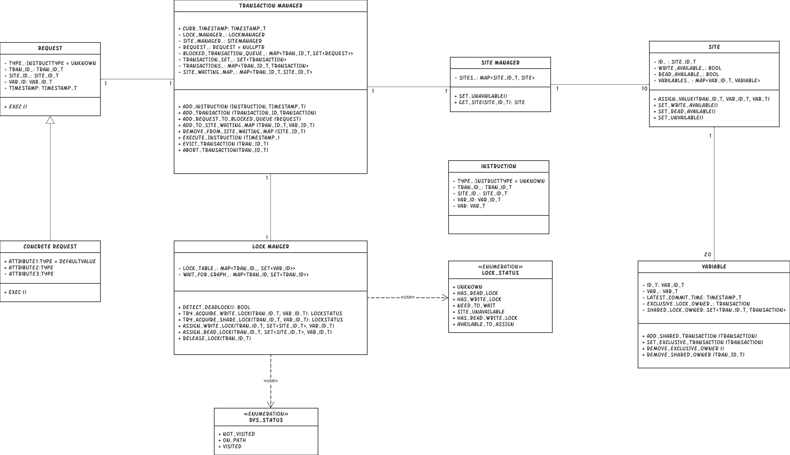
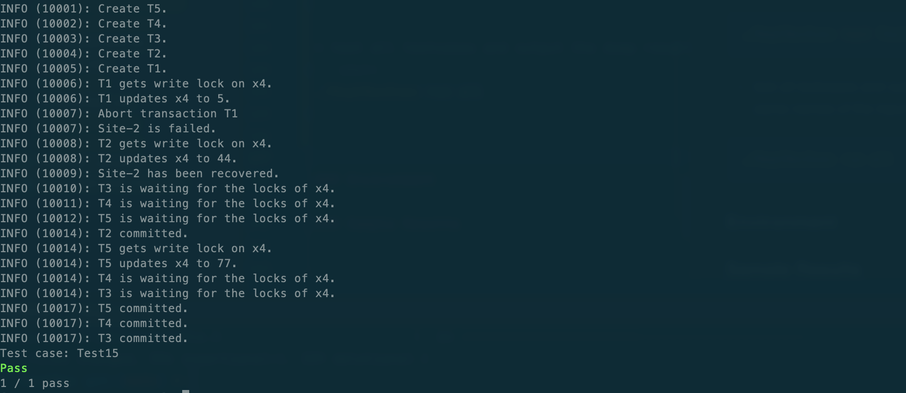
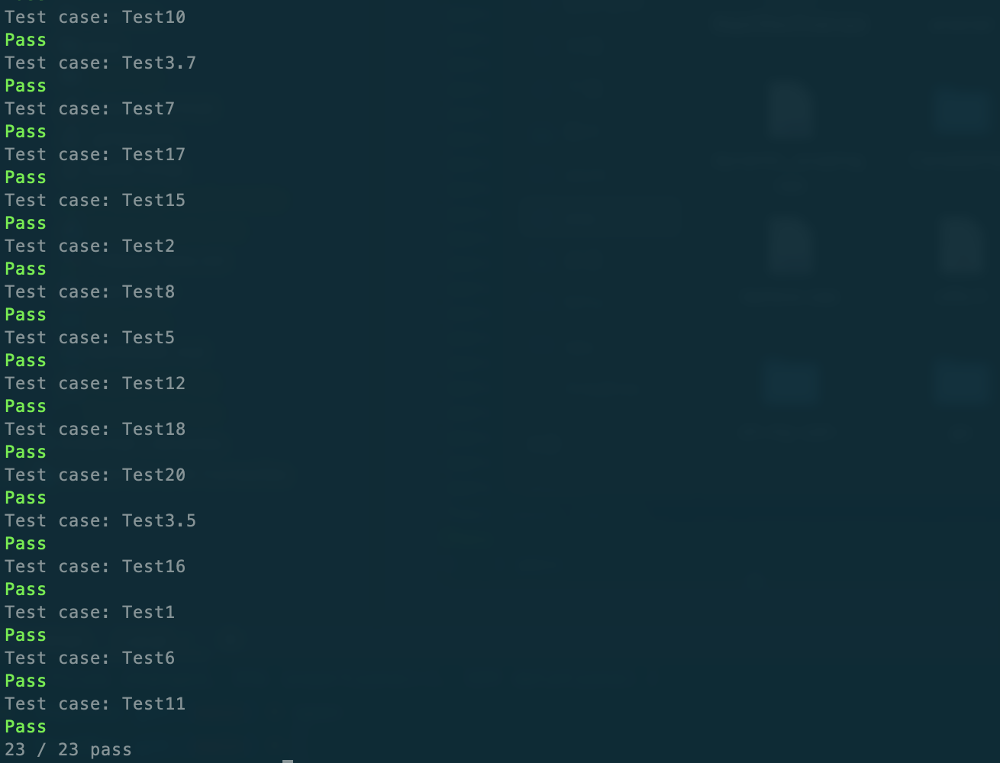

# RepCRec Design Document

> Team Member
> - Junhua Liang
> - Guanqun Yang
>
> Date
>
> - Dec 02, 2023

---

## Introduction

This the course project of advanced database systems at New York University. The project is to implement a simple version of distributed database, complete with multiversion concurrency control, deadlock detection, replication and failure recovery. Normally, this is a multi-year, multi-person effort, but it's doable because the database is tiny.

This project is to make us have deep insight into the design of distributed systems.

---

## Design

### Component

The design for this project contains 8 components. They will be structured together to run the database system simulation. Here, our team will explain the design structure and the logistics of the system.

#### Design Diagram



#### Component Logic

This project contains 8 components.

##### Transaction Manager

Transaction Manager (TM) is the most important component of this project. It controls the Site Manager (SM) and Lock Manager (LM) to manage the transactions and handles incoming requests. Every time a new instruction comes, TM will decouple the instruction and transform it into the high-level data structure Request. Then dynamically call the exec() function of a concrete request.

TM is a **Singleton class** and thus every other component can call the same class and use the same SM and LM to manage the distributed database systems. TM also manages a Blocked Queue, which manages the requests which are blocked by lock-waiting and variable-waiting. Once specific transactions acquire their locks, the requests in the queue will be executed in time order.

##### Site Manager

The Site Manager (SM) manages the 10 sites of this database system. It's located in the TM and provides API to get the specific site. There is only one SM in this database system and can be obtained via the Singleton TM.

##### Lock Manager

The Lock Manager (LM) controls the shared lock and exclusive lock of every variable in this system. LM is managed by TM and can be obtained via TM. LM provides API for deadlock detection, acquiring and assigning shared locks, and exclusive locks.

For the procedure of assigning shared locks or exclusive locks, the LM will first try to acquire the required locks of the variables and will assign the locks to that transaction if and only if it obtained all the required locks.

For the deadlock detection, LM will maintain a wait-for-graph. It will update the wait-for-graph when some transactions acquire locks that are held by other transactions. Deadlock will exist when there is at least one cycle in the wait-for-graph and the TM will abort the youngest transaction.

##### Transaction

Transaction will be created when the TM executes the Begin or BeginRO instruction. It will maintain the transaction id and history of all the sites that it reads or writes. TM will commit all the updates to the site and the corresponding variables when the TM executes the end instruction.

There are two kinds of transactions, the normal read-write transaction, and the read-only transaction. The normal read-write transaction will use two-phase locks to maintain the availability of the variables and will be blocked when the required locks are maintained by other transactions. The read-only transaction will have multi-version concurrency control to read the variables.

##### Site

The Site is the site object in this database system. Each of them will manage the 20 variables' replication. The variables can be written when the site is written available. The variables can be read when the site is read available. The site will lose its read and write availability when the TM executes the fail instruction and will recover its write availability when the TM executes the recovery instruction. When some transaction commits and has some updates on the variable, it will recover the read availability of that variable on the site.

##### Variable

Variable is the variable object within the site. There are 20 variables in each site and each of them will have a unique id from 1 to 20. The odd variable will only store on site 1 + index % 10. The even variables will have replication on every other site. Variables will also have their shared lock and exclusive lock, which are maintained by the LM.

##### Instruction

Instruction is the abstraction of incoming instruction. The system will parse the string type instruction to the object type class. It will maintain its instruction type, transaction id, site id, and variable id. It will be transformed into the Request class later.

##### Request

The Request is the high-level data structure of the instruction. There are 7 types of requests in this system and all of them are inherited from the base Request class. The Request class will maintain the transaction id, site id, and variable id that it will access in the later procedure.

---

## Testing
We unify the output of the testcases with two parts:
* Keys and values on different sites after dump
```
====================================================
site  1 -          	x 2:   20	         	x 4:   77	         	x 6:   60	         	x 8:   80	         	x10:  100	         	x12:  120	         	x14:  140	         	x16:  160	         	x18:  180	         	x20:  200
site  2 - x 1:   10	x 2:   20	         	x 4:   77	         	x 6:   60	         	x 8:   80	         	x10:  100	x11:  110	x12:  120	         	x14:  140	         	x16:  160	         	x18:  180	         	x20:  200
site  3 -          	x 2:   20	         	x 4:   77	         	x 6:   60	         	x 8:   80	         	x10:  100	         	x12:  120	         	x14:  140	         	x16:  160	         	x18:  180	         	x20:  200
site  4 -          	x 2:   20	x 3:   30	x 4:   77	         	x 6:   60	         	x 8:   80	         	x10:  100	         	x12:  120	x13:  130	x14:  140	         	x16:  160	         	x18:  180	         	x20:  200
site  5 -          	x 2:   20	         	x 4:   77	         	x 6:   60	         	x 8:   80	         	x10:  100	         	x12:  120	         	x14:  140	         	x16:  160	         	x18:  180	         	x20:  200
site  6 -          	x 2:   20	         	x 4:   77	x 5:   50	x 6:   60	         	x 8:   80	         	x10:  100	         	x12:  120	         	x14:  140	x15:  150	x16:  160	         	x18:  180	         	x20:  200
site  7 -          	x 2:   20	         	x 4:   77	         	x 6:   60	         	x 8:   80	         	x10:  100	         	x12:  120	         	x14:  140	         	x16:  160	         	x18:  180	         	x20:  200
site  8 -          	x 2:   20	         	x 4:   77	         	x 6:   60	x 7:   70	x 8:   80	         	x10:  100	         	x12:  120	         	x14:  140	         	x16:  160	x17:  170	x18:  180	         	x20:  200
site  9 -          	x 2:   20	         	x 4:   77	         	x 6:   60	         	x 8:   80	         	x10:  100	         	x12:  120	         	x14:  140	         	x16:  160	         	x18:  180	         	x20:  200
site 10 -          	x 2:   20	         	x 4:   77	         	x 6:   60	         	x 8:   80	x 9:   90	x10:  100	         	x12:  120	         	x14:  140	         	x16:  160	         	x18:  180	x19:  190	x20:  200
====================================================
```
The standard output of all 23 cases are provided under the test/output folder
* the trace log of different transactions
```
INFO (10001): Create T5.
INFO (10002): Create T4.
INFO (10003): Create T3.
INFO (10004): Create T2.
INFO (10005): Create T1.
INFO (10006): T1 gets write lock on x4.
INFO (10006): T1 updates x4 to 5.
INFO (10007): Abort transaction T1
INFO (10007): Site-2 is failed.
INFO (10008): T2 gets write lock on x4.
INFO (10008): T2 updates x4 to 44.
INFO (10009): Site-2 has been recovered.
INFO (10010): T3 is waiting for the locks of x4.
INFO (10011): T4 is waiting for the locks of x4.
INFO (10012): T5 is waiting for the locks of x4.
INFO (10014): T2 committed.
INFO (10014): T5 gets write lock on x4.
INFO (10014): T5 updates x4 to 77.
INFO (10014): T4 is waiting for the locks of x4.
INFO (10014): T3 is waiting for the locks of x4.
INFO (10017): T5 committed.
INFO (10017): T4 committed.
INFO (10017): T3 committed.
```

In this project, we provide three testing method:
* run the single testcase and print the log and dump result into console:
```shell
./RepCRecExec print Test15
```


* test the single testcase and output the dump result into single file under test/ (use the same name of the input file)
```shell
./RepCRecExec test Test15
```


* test all testcases under test/input folder and output the dump results under test/ (use the same names of the input file)
```shell
./RepCRecExec run all
```



**if you want to provide some extra testcase, please put it into the test/input folder and follow the format of other testcases!**
### Environment
* C++ 11
* Reprozip
* cims server

---

*This is the end of this project.*

---

